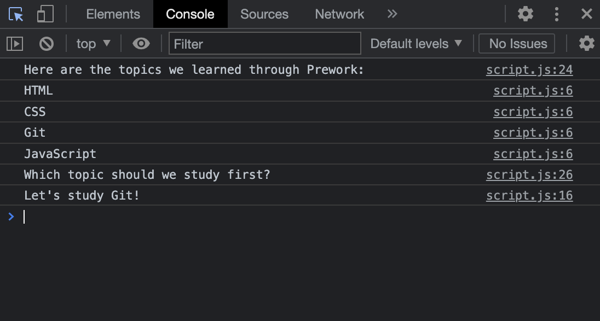

# Prework Study Guide Webpage

## Description

This prework study guide was created to help progress through the UW Coding Bootcamp. With an easy to use interactive notes page, students can easily reference anything they learned in the prework.

## Installation

N/A

## Usage

This webpage features a "jump to" feature with the table of contents. Simply click on any one of the topics you wish to view and it will move to the specified text block. You may also open the Google DevTools to see what to study first.

## Credits

Emma Waltho - Everything

## License

Please refer to the LICENSE in the repo.
